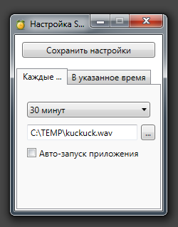
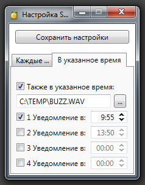
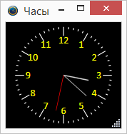

# SMClock
Модульное приложение - Часы-Будильник. Используется .Net Framework 4.8.1
Основное назначение - проиграть короткий звуковой файл в определенное время. 
Часы выводить не обязательно на экран, программа просто висит в трее и по рпасписанию/ям проигрывает короткий WAW файл.

Написано в процессе изучения C# и общей идеии создания модульного приложения.
Часть модулей подгружаются по необходимости, включая необходимые им компоненты.
Поэтому окно настроек запускается не мгновенно. 

Время выставляется путем нажатия на соответствующие мини-кнопки рассположенные справа от поля.

Присутствует создание инсталятора в проекте SMClockSetup ( собирается и выполняется при сборке Release), - на выходе получается MSI файл (Install_SMClock.msi) в корне проекта.
Программа 64-х разрядная, MSI собирался под VS 2022 в x64 среде (Win11).

Примеры звуков, которые не входят в инсталятор, можно забрать из папочки [ExampleSounds](ExampleSounds)

Меню для запуска окна конфигурации и выхода из программы выводится ПКМ на иконке так-же в трее.
 

Так выглядят часы (для вывода выполняем двойной клик ЛКМ на иконке программы в трее):



Как забрать для самостоятельной сборки:
```
git.exe clone -v --progress https://github.com/Ales999/SMClock.git
```
Далее необходимо установить wix tools:

1) Запускаем CMD (Я запускал с админскими правами) и выполняем
```cmd
dotnet tool install --global wix --version 4.0.1
```
2) Проверяем что все установилось корректно:
```cmd
dotnet tool list --global
```
После чего уже собираем проект В VS, переключившись на Release.

В проекте используются стронние компоненты :

* [Caliburn.Micro](http://caliburnmicro.com) - MVVM Framework.
* [StrucureMap](http://structuremap.github.io) - DI контейнер.
* [Sharp-Config](https://github.com/ruarai/SharpConfig) - The author closed the project! Буду использовать ранее [форкнутую](https://github.com/Ales999/SharpConfig) версию с моими правками, как встроенный каталог.
* [Extended.Wpf.Toolkit](https://github.com/xceedsoftware/wpftoolkit) (используется только UserControl, для выбора времени срабатывания ). Новые версии не использую поскольку сменилась лицензия.
* [Trigger.Net](https://github.com/Novakov/trigger.net) - Планировщик выполнения задач.
* [AnalogClock](http://www.sabrinacosolo.com/multiclock-visualizzare-un-orologio-analogico/) (визуальные часы)
* [WixSharp](https://github.com/oleg-shilo/wixsharp) - создание инсталятора (use new developent WiX V4 - waiting next release)
